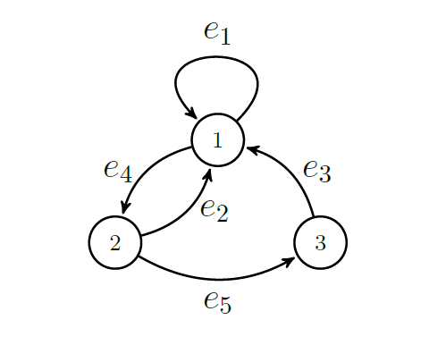
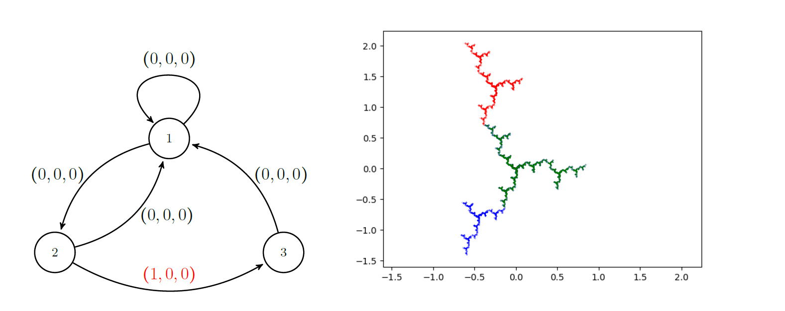
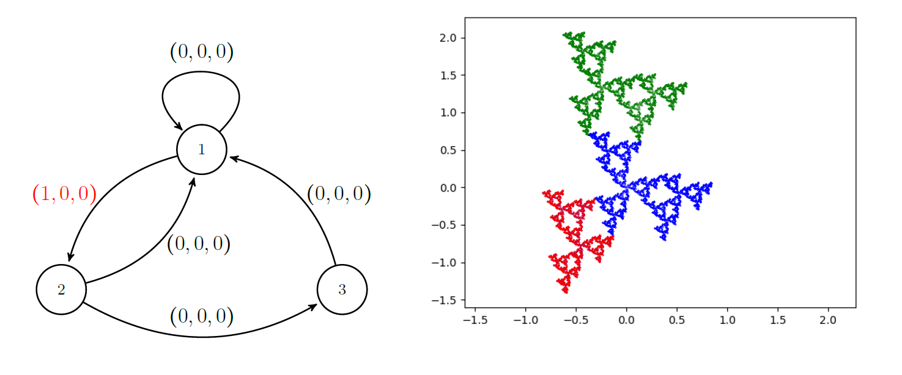
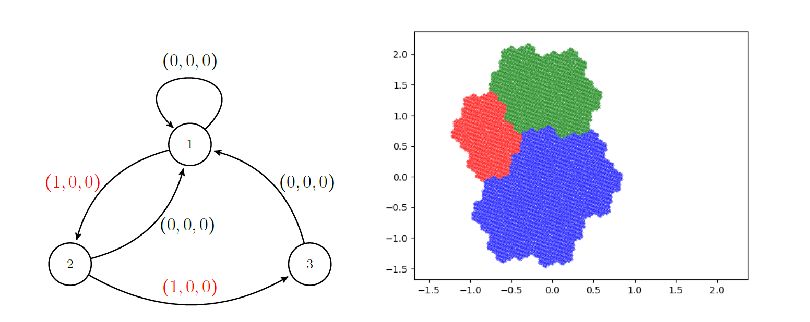
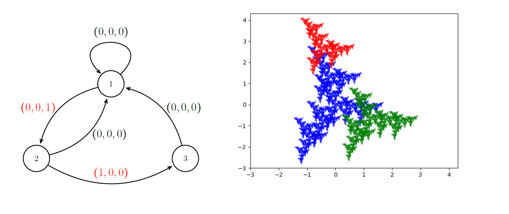

# Finite-graph-fractal-sets
This repository contains python code for creating fractal sets from labellings on a finite directed graph.
We use the tribonacci graph with the following labelling on the edges.

A user can decide on a labelling (a,b,c) where a,b,c are real numbers, to each of the edges of the graph and the code will output a fractal-like set in the xy-plane.  

Here are a few examples of the sets that the code produces.  

We can combine the above two labellings to create the Rauzy fractal!

Just as another example:

The mathematics behind this code involves Markov partitions of hyperbolic toral automorphisms.  There are a lot of mathematical questions to explore with this code.  Which labelings produce sets which are the closure of their interiors? Which labelings produce totally disconnected sets?  Which labelings give non-overlapping sets? 
